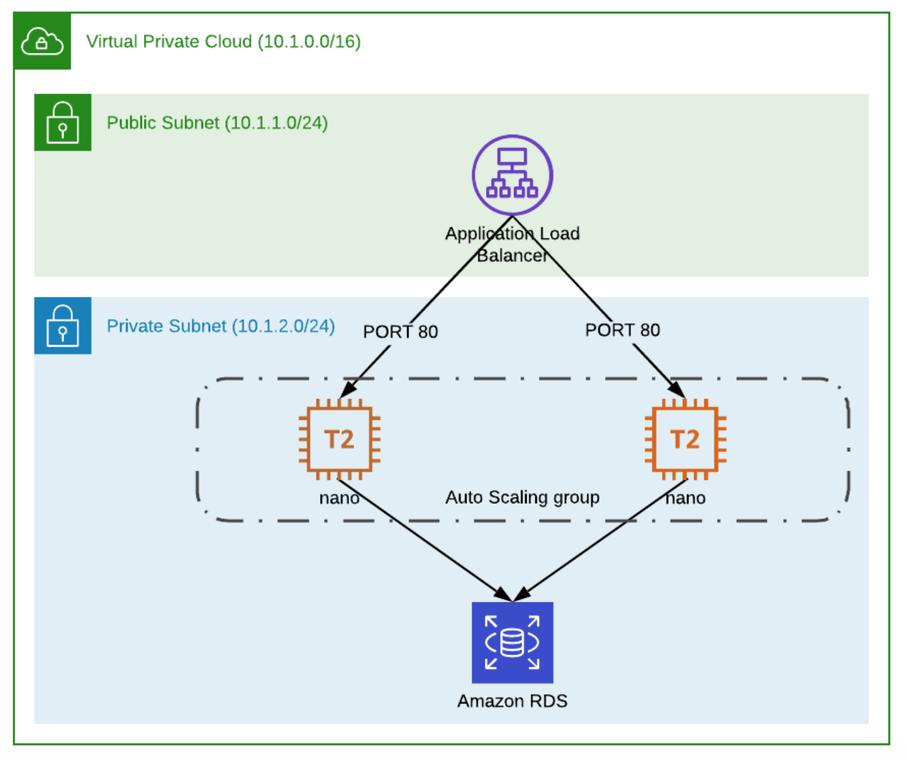

# Cloudformation test project

The stack describes resources explicitly mentioned in the task diagram, some additional resources enabling communication between them and providing accesses (security groups, internet gateways, route tables, target groups), and finally some resources not required by the task itself, but by some of its components (additional subnets, DB subnet group). 

These are two mock additional subnets:
- an additional private subnet with a hardcoded CIDR block (10.1.4.0/24) for creating a DBSubnetGroup required for by an RDS DB instance
- an additional public subnet with a hardcoded CIDR block (10.1.3.0/24) required by Application LB
All subnets are configured with hardcoded availability zones values to avoid collision (since both Application LB and DBSubnetGroup require having subnets within at least two availability zones).

The stack takes three input parameters:
- CIDR blocks for public and private subnets (as explicitly mentioned in the task)
- DB Master password required for an RDS instance with standard MySQL password value constrains

For enabling communication between components, I created three security groups, allowing traffic between:
- the outbound internet and the loadbalancer
- the loadbalancer and ec2 instances
- ec2 instances and the DB instance

All security groups are set to allow traffic from/to resources having corresponding security groups associated.

More details for each resource can be found directly in the code.
